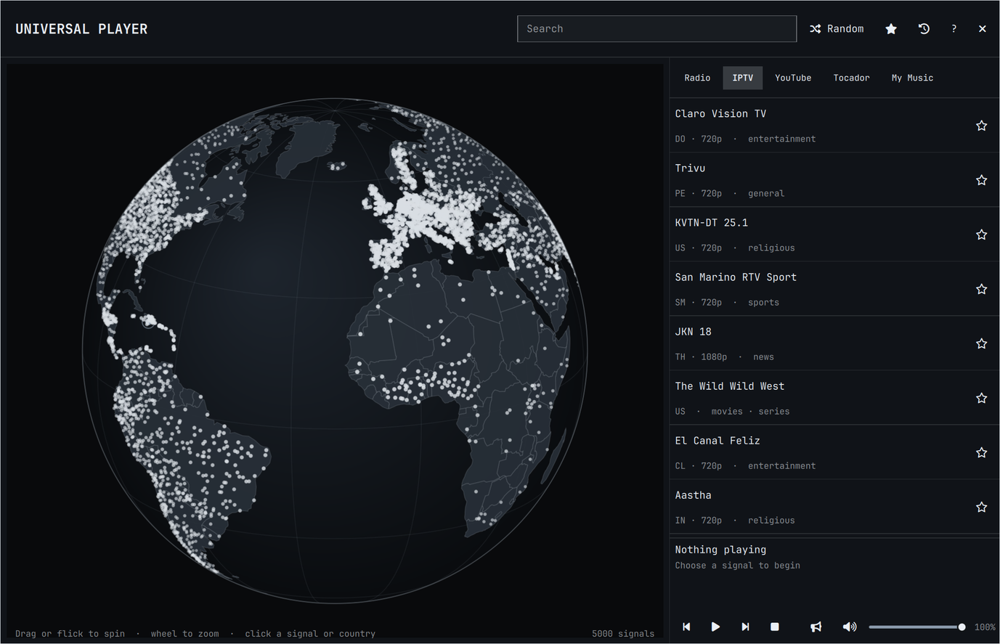

# Tocador

> A connector-based Omarchy music player, evolved from
> [AksharP5/omarchy-radio-atlas](https://github.com/AksharP5/omarchy-radio-atlas).

Explore live radio on a rotatable globe, then switch to an animated album world
without switching players. Tocador connects Radio Browser, its aggregated
[UQT and Hominis Canidae archives](https://tocador.cc/), and local or synced music folders such as
Nextcloud. Playback stays in one `mpv` queue and remains available through
Omarchy's media controls.

Tocador is an [Omarchy](https://omarchy.org) shell plugin: it builds on Omarchy's
Quickshell UI components, so it needs Omarchy and won't run on a plain Hyprland setup.

[View Tocador on the Omarchy Plugin Marketplace](https://omarchyplugins.com/plugin.html?id=akshar.radio-atlas)



## Features

- Kinetic drag rotation that highlights a nearby station when it settles, plus deep wheel zoom on a theme-aware globe
- A fast cached world view that progressively adds thousands of stations and keeps the session catalog when closed
- Country stations stay on the session globe and take priority over background signals
- Country-level map estimates when a station has no published coordinates
- Automatic country focus for the station that is actually playing
- Current station identity, track metadata, and one-click favoriting in the player
- Song identification for stations without track metadata: the music-note button (or `I`) samples ~12s of the stream and asks Shazam via [`songrec`](https://github.com/marin-m/SongRec); the result shows in the player, the bar tooltip, and a notification
- Instant cached results while full-directory search and country browsing refresh from Radio Browser
- A first-class **Albums** mode with an animated, theme-aware cover wall and album-specific queues
- Live TV: about 10,000 free channels from [iptv-org](https://github.com/iptv-org/iptv) on the same globe, playing video in a floating mpv window
- Three source choices: global live radio, one Tocador connector aggregating UQT + Hominis, and configurable music folders
- Universal search across Radio, Tocador, and My Music, with visible source labels
- Local and Nextcloud-synced libraries are indexed from user configuration rather than hard-coded paths
- One player for stations and tracks, with automatic advance at the end of album tracks
- Random tuning that avoids recent stations, plus favorites and listening history
- Independent volume slider, mute, and bar-wheel volume control
- Audio output picker that routes radio to any PipeWire sink, including AirPlay speakers exposed as RAOP sinks
- Centered, floating window with normal Omarchy window-manager behavior
- Automatic dismissal when Omarchy starts its screensaver
- Keyboard navigation
- Persistent world and country caches with background refresh and transient retries
- Keeps your chosen station selected if its stream fails, with explicit retry or next controls

## Install

```bash
omarchy plugin add https://github.com/belisards/tocador-widget.git --enable
```

Tocador uses `bubblewrap`, `curl`, `ffmpeg`, `ffprobe`, `iproute2`, `jq`, `mpv`, `python`,
`socat`, `coreutils`, and `util-linux`. These packages ship with Omarchy.
`mpv-mpris` connects playback to `omarchy.media` and is also part of the
standard Omarchy installation.

## Remove

Stop the independent radio player before removing the plugin:

```bash
~/.config/omarchy/plugins/akshar.radio-atlas/radio-player stop
omarchy plugin remove akshar.radio-atlas
```

Favorites, listening history, volume, and the selected audio output remain in
`~/.local/share/radio-atlas/state.json` so reinstalling restores them. Remove
`~/.local/share/radio-atlas/` manually if you also want to delete that data.

## Live TV

The **TV** tab (or `T`) swaps the globe to live TV channels from the
community-maintained [iptv-org](https://github.com/iptv-org/api) catalog.
The catalog is downloaded once a day (about 11 MB) to
`~/.cache/omarchy-radio-atlas/tv.json`; searching and browsing a country read
that cache locally. Adult, closed, and legally blocklisted channels are
excluded, and each channel keeps its most reliable stream. Channels only
publish a country, so their signals sit on country estimates.

TV uses the same behind-the-scenes `mpv` player, queue, sandbox, and Tocador
transport controls as audio. Video is enabled only for TV entries and opens in
a centered 960×540 floating surface with the `radio-atlas-tv` class; closing
that surface stops playback.

### Live YouTube subscriptions

Channels you subscribe to on YouTube appear at the top of the TV list while
they are broadcasting live. Enable the `youtube-subscriptions` connector in
`~/.config/radio-atlas/connectors.json` and point `auth` at a browser-headers
file from a YouTube Music login, such as the `auth.json` that
[ytmusicapi](https://ytmusicapi.readthedocs.io/en/stable/setup/browser.html)
produces:

```json
{ "id": "youtube", "type": "youtube-subscriptions",
  "auth": "~/.config/yt-music/auth.json", "enabled": true }
```

Tocador reads that session only to fetch your signed-in YouTube sidebar,
which flags subscriptions that are live, and caches the result for three
minutes in `~/.cache/omarchy-radio-atlas/youtube-live.json` without any
credentials. Playback opens the channel's public `/live` page through `yt-dlp`
inside the sandbox and never receives your cookies. The sidebar covers the
subscriptions YouTube ranks as most relevant, not necessarily all of them,
and live channels have no country, so they are listed but not placed on the
globe. This needs `yt-dlp` with a JavaScript runtime such as `deno`. Many free streams are geo-blocked or
offline at any moment; when one fails, press Next. Open TV directly with
`omarchy-shell shell toggle akshar.radio-atlas '{"action":"tv"}'`.

## Music-folder connectors

Copy `connectors.json.example` to
`~/.config/radio-atlas/connectors.json`, then enable one or more folder
connectors. Any locally mounted or synced folder works; Nextcloud is simply a
folder connector pointed at its synchronized music directory.

The real configuration lives outside the repository and is ignored if a local
copy is accidentally placed in the checkout. Commit `connectors.json.example`
only; never commit `connectors.json`, which may reveal private usernames and paths.

```json
{
  "connectors": [
    {
      "id": "nextcloud",
      "type": "folder",
      "name": "My Music",
      "path": "/home/you/Nextcloud/music",
      "enabled": true
    }
  ]
}
```

Tocador scans common audio formats, reads one representative file per
album for metadata, discovers sidecar, media-art, and embedded covers, and caches the
result for an hour. Use the refresh button in Albums to rebuild the index.
`RADIO_ATLAS_MUSIC_DIRS=/path/one:/path/two` is available as a temporary
override. Local playback is restricted to enabled folder roots.

## Controls

| Input | Action |
| --- | --- |
| Drag or flick globe | Rotate; a flick coasts and highlights a nearby station |
| Wheel over globe | Zoom |
| Click signal | Play station |
| Click country | Browse country |
| `/` | Focus search |
| Up / Down | Move through stations |
| Enter | Play selected station |
| Space | Play or pause |
| `R` | Tune a random station, or refresh the active album connector |
| `T` | Switch between radio and TV |
| `F` | Favorite selected station |
| `I` | Identify the playing song (needs `songrec`) |
| `+` / `-` | Raise or lower radio volume |
| `M` | Mute or unmute |
| Speaker icon | Choose the audio output |
| `?` | Show or hide controls |
| Escape | Hide controls, clear search, or close |

Open Tocador's aggregated UQT + Hominis view directly with
`omarchy-shell shell toggle akshar.radio-atlas '{"action":"tocador"}'`, open local albums with
`omarchy-shell shell toggle akshar.radio-atlas '{"action":"albums","source":"library"}'`,
or start Tocador headless with
`radio-player tocador`. Archive catalogs are cached for a week in
`~/.cache/radio-atlas/`.

On the bar, left click opens Tocador, middle click tunes randomly, right
click stops its player or resumes the most recently played station when stopped,
and the mouse wheel adjusts radio volume. If there is no listening history,
right click does nothing.

If a station disconnects or cannot be played, Tocador keeps it selected and
shows the failure. Click the play button to retry that station, or Next/Previous
to choose another queued station. It does not automatically reconnect or switch
stations. A repeated opening clip can come from the station's stream server;
retrying may play that same clip again. Radio Browser supplies station listings,
not the audio streams.

Fresh world and country caches load without DNS lookups. The globe skips
off-screen station markers when zoomed in, and player-status updates for the
same station preserve the landing highlight without repainting the globe.
Track-title, volume, and pause updates also preserve your station-list selection.
Theme colors update the globe immediately. Background station expansion stops
after three consecutive attempts add no stations, including failed requests;
reopening Tocador allows expansion to try again.

## Audio outputs and AirPlay

The speaker button next to the volume slider chooses where radio plays. It lists
every PipeWire output device through `pactl`, which ships with Omarchy's
PipeWire setup. "System default" follows the desktop's current output, the
choice is saved alongside the volume in `~/.local/share/radio-atlas/state.json`,
and switching while playing takes effect immediately. If the chosen device
disappears, mpv may pause and will not always resume when it returns. Choose
"System default" or another available output, then resume playback.

AirPlay speakers appear in this list once PipeWire exposes them as RAOP sinks.
On Arch Linux, the RAOP modules ship in the optional `pipewire-zeroconf`
package. Install it, enable discovery, and restart the user services:

```bash
sudo pacman -S pipewire-zeroconf
mkdir -p ~/.config/pipewire/pipewire.conf.d
cp /usr/share/pipewire/pipewire.conf.avail/50-raop.conf \
  ~/.config/pipewire/pipewire.conf.d/
systemctl --user restart pipewire wireplumber
```

If you run a firewall such as ufw, allow the timing feedback AirPlay speakers
send back to the sender on UDP ports 6001-6002; without it the session connects
but the speaker stays silent:

```bash
sudo ufw allow in from 192.168.0.0/16 to any port 6001:6002 proto udp
```

PipeWire's RAOP discovery occasionally drops a sink when a device briefly
stops announcing itself over mDNS. If an AirPlay speaker disappears from the
output list, re-discover it with `systemctl --user restart pipewire wireplumber`.

PipeWire's RAOP sink streams classic AirPlay audio as uncompressed PCM.
AirPort Express, Apple TV, many AV receivers, and HomePods accept it; AirPlay 2
only features such as HomePod stereo pairs are not supported. A device that
refuses the stream simply stays silent; pick another output to recover.

## Data and privacy

Station data comes from the community-run
[Radio Browser](https://www.radio-browser.info/). Tocador sends its name
and version as the HTTP user agent. Starting a station calls Radio Browser's
click-count endpoint. Favorites and history stay in
`~/.local/share/radio-atlas/state.json`.

TV channel data comes from iptv-org's public API on GitHub Pages; no playback
or search data is sent back to it. Station metadata and stream URLs are community supplied. Labels are rendered
as plain text. Playback runs in an isolated network namespace and reaches
stations through a bounded proxy that rejects private and effectively local
destinations, including after redirects. Remote metadata and local JSON are
size- and record-limited before they reach the shell. Tocador still connects
directly to third-party stations; HTTP streams are unencrypted. Only play
stations you trust.

Map geometry comes from public-domain Natural Earth data.

Folder connector metadata and cover paths remain local. The index is cached at
`~/.cache/radio-atlas/library.json`; Tocador does not upload a local
library or send it to Radio Browser or Tocador.

## Roadmap

- OpenSubsonic connector for user-owned Navidrome, Gonic, and Airsonic servers
- Native Funkwhale connector for explicitly chosen pods and libraries
- Connector settings UI, per-connector health, and search capabilities
- Optional Jellyfin connector

These are intentionally roadmap items. Tocador does not scrape commercial
music services or mix anonymous open-catalog discovery into a personal library.

## Troubleshooting

Player and proxy diagnostics are written to
`$XDG_RUNTIME_DIR/omarchy-radio-atlas/mpv.log` and `proxy.log`. Proxy diagnostics
identify request, connection, and relay failures, idle timeouts, and which side
closed a connection. They omit URLs, hostnames, and raw error messages and are
capped at 200 lines per player session. Stopping and starting playback begins
a new session and replaces those logs. A connection closing is not necessarily
an error; it also happens when changing stations or stopping playback.

If saved state is malformed, oversized, or contains too many entries, Tocador
refuses to overwrite it and reports
`~/.local/share/radio-atlas/state.json`; back up that file before repairing or
removing it.

<a href="https://www.greptile.com/?utm_source=oss_badge&amp;utm_medium=readme&amp;utm_campaign=greptile_for_open_source">
  
</a>

## Development

The native QML tests require Qt 6.5 or newer for the globe's drag-event API.
CI runs them on Ubuntu 26.04 with Qt 6.10.

```bash
./tests/run
qmllint -I /usr/share/omarchy/shell BarWidget.qml Globe.qml RadioAtlas.qml
```
